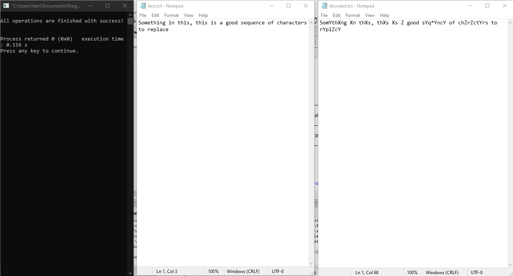
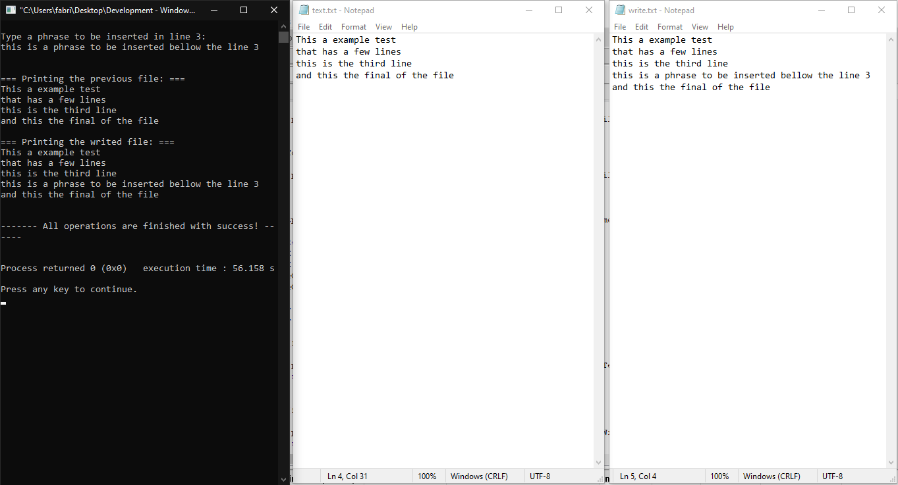
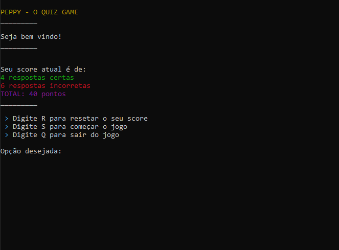
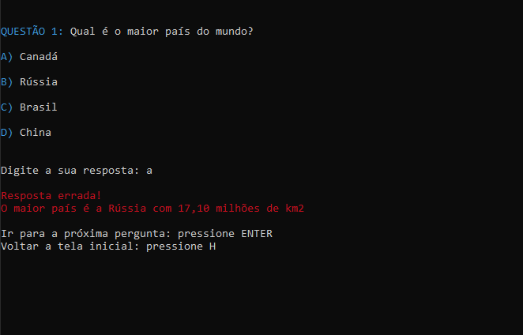

<h5 align="center">
  <br><br>
  <b>Exercises in C programming Language!</b> :gun:
</h5>
<p align="center">
  
  
</p>

## Exercises and Projects

- [Exercise - Decoding a text](https://github.com/pferreirafabricio/c-exercises#deconding-text)
- [Exercise 2 - Generating a new file](https://github.com/pferreirafabricio/c-exercises#generating-a-new-file)
- [Project 1 - A simple quiz game](https://github.com/pferreirafabricio/c-exercises#a-simple-quiz-game)

### :abacus: Deconding Text

It is a simple program that read a file and replace the specified characters in the file (in this case vogals) by anothers characters.

<br/>

### :scroll: Generating a new file

It is a simple program that read a file and, when reading the line 3, prompt a input for the user type a phrase that will be inserted bellow the line 3 in a new file.

<br/>

### :joystick: A simple quiz game

A simple game to practice about modularization, string and file manipulation, ... In this game the user have to respond 10 questions about general subjects. When finished the game the score is saved and displayed in the initial screen.


<br/>

## :bricks: This project was built with: 
- [C](https://www.cprogramming.com/)
- [Code::Blocks](http://www.codeblocks.org/)

## :recycle: Contribute
 1. Fork this repository;
 2. Create a branch with your feature: ```git checkout -b my-feature```
 3. Commit your changes: ```git commit -m 'feat: My new feature'```
 4. Push your branch: ```git push origin my-feature```
 
## :page_with_curl:	License
This project is under the MIT license. Take a look at the [LICENSE](LICENSE.md) file for more details.
